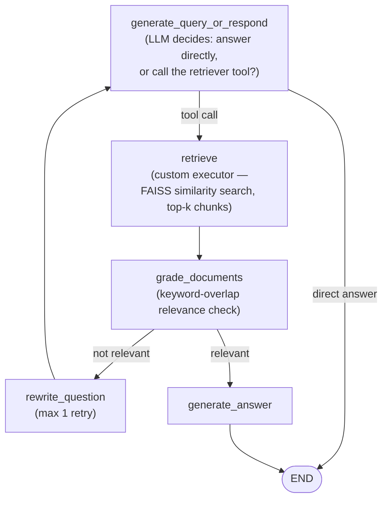

# AgentRAG — Agentic RAG with LangGraph

A Retrieval-Augmented Generation chatbot built as a **stateful agent graph** (LangGraph) rather than a single fixed pipeline — the agent decides whether to retrieve at all, grades its own retrieved documents for relevance, and rewrites the query and retries once if the first retrieval was weak, before ever generating an answer.

Live app: **[add your Streamlit Cloud link here]**

## Why a graph instead of a linear RAG chain

Most basic RAG pipelines are a fixed sequence: embed query → retrieve → generate. That fails in two common situations this project addresses:

1. **Not every message needs retrieval.** A user saying "hi" or "thanks" shouldn't trigger a vector search — it should just get a direct reply.
2. **Retrieval sometimes misses.** A poorly-phrased or ambiguous question can retrieve irrelevant chunks on the first try. A linear pipeline has no way to notice this and recover; it just generates from whatever it retrieved.

This project models the whole interaction as a graph with conditional routing, so the agent can make both of these decisions dynamically per message rather than always doing the same fixed steps.
## Architecture



- **`generate_query_or_respond`** — the entry node. Skips the LLM entirely for greetings/small talk (fast path), otherwise lets the model decide whether the question needs the knowledge base via LangChain tool-calling.
- **`retrieve`** — runs the FAISS similarity search tool. Implemented as a custom executor (not LangGraph's built-in `ToolNode`) specifically to avoid a `KeyError` that occurred with `ToolNode`'s module-path-based tool lookup when deployed on Streamlit Cloud.
- **`grade_documents`** — checks retrieved chunks against the question's keywords (excluding short stop words). Needs at least 2 keyword matches or 40% keyword coverage to pass as "relevant."
- **`rewrite_question`** — if grading fails, an LLM call reformulates the question and the graph loops back to `generate_query_or_respond` for a second retrieval attempt. Capped at one retry to prevent infinite loops — after that, the agent proceeds with whatever it has rather than looping forever.
- **`generate_answer`** — produces the final answer from the graded-relevant context, instructed to say it doesn't know rather than guess when the context doesn't contain the answer.

## Retrieval & ingestion

- **Sources:** local files (`data/`, PDF/TXT via `loaders/local_loaders.py`) and web pages (`loaders/web_loaders.py`, URLs configured in `configs/urls.json`, scraped with BeautifulSoup).
- **Chunking:** token-aware recursive splitting (`split/splitter.py`, tiktoken-based, 500 tokens/chunk with 100 token overlap).
- **Embeddings:** `all-MiniLM-L6-v2` via `sentence-transformers` (384-dim, CPU-friendly) — chosen specifically to avoid requiring a local Ollama server, so it runs on any machine or cloud instance out of the box.
- **Vector store:** FAISS flat L2 index (`vectorstore/`), with support for **appending new documents without a full rebuild** (`add_documents`) — this backs the in-app file upload feature, so a user can drop in a new PDF/TXT during a session and it's searchable immediately.
- **LLM:** Groq API (`generate_query_or_respond` uses `openai/gpt-oss-120b` for tool-calling accuracy; `rewrite_question` and `generate_answer` use `llama-3.1-8b-instant` for low-latency responses).

## Features

- Multi-turn conversation memory (full message history passed through graph state via LangGraph's `add_messages`)
- Adaptive retrieval — skips retrieval for conversational messages, triggers it for factual questions
- Self-correcting retrieval — one automatic query rewrite + retry if the first retrieval scores as irrelevant
- In-app file upload — add new documents to the knowledge base at runtime without restarting or rebuilding the whole index
- Dark "agentic" themed Streamlit UI with a live terminal-style log panel showing each graph node firing in real time

## Running it

```bash
pip install -r requirements.txt
```

Create a `.env` file in the project root:
```bash
python run_app.py
```

This starts the Streamlit app (`chat_app.py`) with the project root on `PYTHONPATH` so the `agent.*` / `loaders.*` / `vectorstore.*` module imports resolve correctly.

### Rebuilding the index
The committed `vectorstore/` already contains an index built from `data/agentic_ai_notes.txt` and the URLs in `configs/urls.json`. To rebuild after changing sources:
```bash
python -c "
from ingest.ingestion import load_all_documents
from split.splitter import split_documents
from embeddings.embed import EmbeddingService
from vectorstore.index_builder import FaissIndexBuilder

docs = load_all_documents()
chunks = split_documents(docs)
embedder = EmbeddingService()
builder = FaissIndexBuilder(embedder)
builder.build_index(chunks)
builder.save_index()
"
```

### Deploying on Streamlit Community Cloud
Set `GROQ_API_KEY` under the app's **Secrets** in the Streamlit Cloud dashboard (not a `.env` file — that's git-ignored and never deployed). `chat_app.py` already checks `st.secrets` and falls back to it if the env var isn't set locally.

## Notes on deployment-specific workarounds

Two things in this codebase exist specifically because of quirks hit while deploying to Streamlit Community Cloud, not because they're best practice in general — worth knowing if extending this:

- **Custom `execute_retrieval` executor instead of `ToolNode`** — the built-in tool node resolves tools by their Python module path, which triggered a `KeyError: 'agent.retriever_tool'` in the Streamlit Cloud environment. Bypassing it with a direct function call sidesteps that.
- **Conditional `IS_LOCAL` import guard** in `chat_app.py` around `get_retriever` — the file-upload feature (which needs direct retriever access) is only wired up when running locally, detected via checking for the `/mount/src` path that's specific to Streamlit Cloud's container.

## What I'd improve with more time

- Replace the keyword-overlap document grader with an LLM-based or cross-encoder relevance grader — keyword overlap is fast but is a weak proxy for actual semantic relevance and would misjudge well-phrased questions that don't share vocabulary with the source text.
- Add source citations to generated answers so a user can verify which retrieved chunk backs a given claim, rather than an unattributed answer.
- Add persistent chat history across sessions (currently in-memory only, reset on reload).
- Expand the eval set beyond manual testing — no automated accuracy/relevance metrics currently exist for this project.
                       
